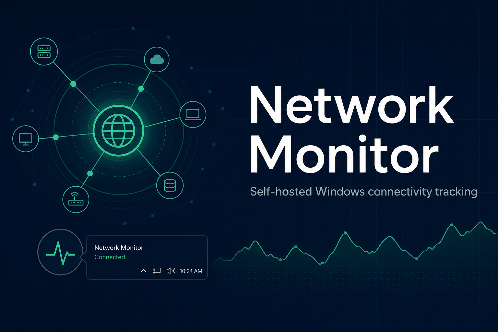
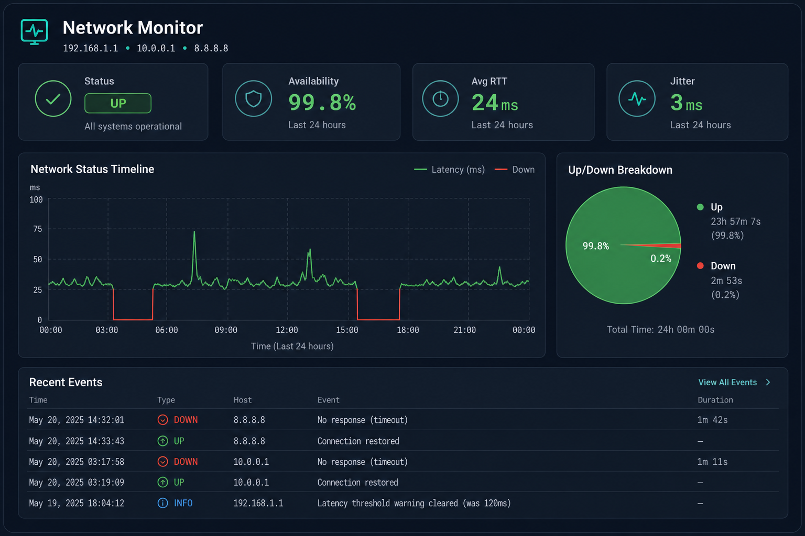
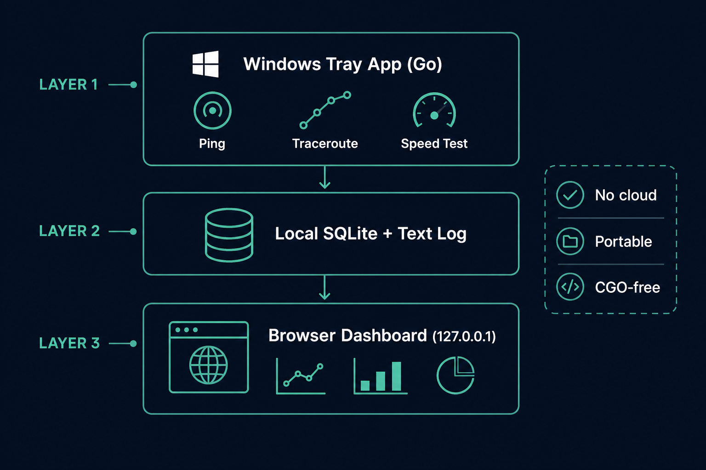

# Network Monitor



**Self-contained Windows connectivity monitoring** — ping, traceroute, speed tests, and a local browser dashboard. No installer, no cloud account, no external database.

[](https://go.dev/)
[](https://www.microsoft.com/windows)
[](LICENSE)

---

## Overview

Network Monitor is a portable Windows application that runs quietly in the system tray and records internet health over time. It pings a configurable target every second, runs traceroutes on a schedule (and during confirmed outages), performs periodic speed tests, and stores everything locally in SQLite.

Open the built-in dashboard at `http://127.0.0.1:8080/` to review latency history, availability, jitter, route changes, public IP shifts, and export your data.



---

## Features

### Monitoring
- **Continuous ping** — 1-second interval by default; configurable target host
- **Outage detection** — requires consecutive failures before marking DOWN; optional verification delay
- **Traceroute** — routine healthy-path traces plus captures during confirmed outages
- **Speed tests** — scheduled and on-demand download/upload tests via configurable CDN endpoints
- **Public IP tracking** — detects public IP changes with provider echo-service status
- **Private IP display** — local address, subnet mask, and default gateway in the dashboard header

### Dashboard
- **Summary cards** — status, availability, avg RTT, jitter, last outage, speed test results (customizable)
- **Network Status Timeline** — interactive RTT chart with outage highlighting; optional pop-out view
- **Up/Down breakdown** — pie chart for the selected time range
- **Event list** — outages, recoveries, public IP changes, and more
- **Traceroute panels** — last successful path vs. latest outage trace
- **Customizable layout** — show/hide widgets, drag-and-resize grid in edit mode; preferences saved in the browser

### Application
- **System tray** — background operation with no console window
- **Single instance** — prevents duplicate copies fighting for the same port
- **Portable** — `NetworkMonitor.exe` + `config.yaml` + `data\` folder
- **Local-only** — dashboard binds to `127.0.0.1`; data never leaves your machine unless you export it
- **Retention** — automatic purge of records older than configured days (default 365)
- **Text log** — human-readable append-only log alongside SQLite
- **Update checks** — optional manifest-based update checking with instance ID header
- **Windows autostart** — optional startup registration

---

## Architecture



| Layer | Technology |
|-------|------------|
| Core app | Go 1.22, `CGO_ENABLED=0`, pure Go |
| Storage | SQLite (`modernc.org/sqlite`) + text log |
| Web UI | Embedded HTML/CSS/JS, Chart.js |
| Tray | `fyne.io/systray` |

The web UI is embedded in the binary (`//go:embed`). The dashboard talks to a local REST API; the monitor goroutine writes probe results to the database independently.

---

## Quick start

### Requirements
- **Windows 10/11** (amd64)
- No separate runtime — the release build is a single `.exe`

### Run
1. Download or build `NetworkMonitor.exe`
2. Place it alongside `config.yaml` (included in the repo)
3. Double-click `NetworkMonitor.exe` — it appears in the system tray
4. Open **http://127.0.0.1:8080/** in your browser

Right-click the tray icon to exit.

### Portable layout
```
NetworkMonitor/
├── NetworkMonitor.exe
├── config.yaml
└── data/
    ├── network_monitor.db
    ├── NetworkMonitor.log
    └── NetworkMonitor-app.log
```

---

## Build from source

Requires [Go 1.22+](https://go.dev/dl/).

```powershell
git clone https://github.com/mdkeenan/network-monitor.git
cd network-monitor
.\build.ps1
```

This produces `NetworkMonitor.exe` with version `v1.0.0` and today's build date baked in via ldflags.

### Rebuild and restart (development)
```powershell
.\update-and-run.ps1 -Background -OpenBrowser
```

| Flag | Effect |
|------|--------|
| `-Background` | Run detached (no console) |
| `-OpenBrowser` | Open dashboard after start |
| `-SkipBuild` | Restart without recompiling |

---

## Configuration

Settings live in `config.yaml` next to the executable. Key options:

| Setting | Default | Description |
|---------|---------|-------------|
| `target` | `8.8.8.8` | Host or IP to ping |
| `ping_interval_sec` | `1` | Seconds between pings |
| `trace_interval_sec` | `30` | Traceroute interval during instability |
| `healthy_trace_interval_sec` | `300` | Traceroute interval when UP |
| `required_successes` | `5` | Consecutive successes before UP |
| `verify_delay_sec` | `5` | Delay before outage verification trace |
| `web_port` | `8080` | Dashboard port (`127.0.0.1` only) |
| `data_dir` | `data` | SQLite and logs directory |
| `retention_days` | `365` | Auto-purge age for stored records |
| `speedtest_interval_min` | `60` | Minutes between scheduled speed tests |
| `auto_check_updates` | `true` | Check for updates on startup |
| `update_manifest_url` | *(empty)* | URL of JSON update manifest |

Most settings can also be changed from **Settings** in the dashboard UI.

---

## API (local)

All endpoints are on `http://127.0.0.1:<web_port>/api/`.

| Endpoint | Description |
|----------|-------------|
| `GET /api/status` | Current monitor state |
| `GET /api/summary` | Summary metrics (availability, RTT, jitter, …) |
| `GET /api/pings` | Ping history for charts |
| `GET /api/events` | Event log |
| `GET /api/version` | Version and instance ID |
| `GET /api/public-ip` | Public IP and ISP info |
| `GET /api/private-ip` | Local network info |
| `GET /api/speedtest/*` | Speed test config, results, upload |
| `GET /api/export` | Data export |
| `GET /api/settings` | Read/write settings |

---

## Instance ID

Each installation has a compound instance ID shown in **Settings → About**:

```
<INSTANCE>-<VERSION>-<BUILD>-<INTEGRITY>
```

Only the instance segment is persisted; version, build date, and integrity hash are recomputed at startup. The full ID is sent as `X-Instance-ID` when checking for updates.

---

## Development

```powershell
go test ./...
.\build.ps1
```

### Project layout
```
├── main.go                 Entry point, tray, HTTP server
├── config.yaml             Default configuration
├── build.ps1               Production build script
├── internal/
│   ├── monitor/            Ping, traceroute, speed test loops
│   ├── database/           SQLite schema and queries
│   ├── server/             HTTP API + embedded web UI
│   ├── config/             YAML config load/save
│   ├── instanceid/         Compound instance ID
│   ├── updates/            Update manifest checking
│   ├── publicip/             Public IP watcher
│   └── tray/                 System tray icon
└── docs/images/            README screenshots and diagrams
```

---

## License

MIT — see [LICENSE](LICENSE).

Copyright © 2026 [Michael Keenan](https://www.linkedin.com/in/michaeldkeenan/)

---

## Author

Built by **Michael Keenan** — feedback and contributions welcome via [GitHub Issues](https://github.com/mdkeenan/network-monitor/issues).
